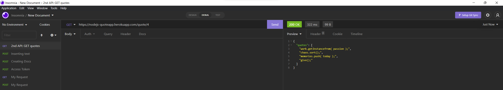

# -Synchronous-API-mashup
Queried two API synchronously, requiring clint authentication via Three-legged OAuth. Used several http requests and modified the response to be displayed on the server and the authenticated account.

- API Keys are typically the easiest as you get them when registering your application.  
- OAuth 2.0 Client Credential requires your application to dynamically trade Client ID and Client secret for an access token, before being able to interact with the API. 
- A three-legged OAuth request is the most complex as it involves explicitly getting permissions from a third entity, the end user.

## I wanted the APIs to operate synchronously.

This means if we have Requests A and B, Request A must finish (received response) before Request B begins.

# Insominia Screenshots
To Display HTTP requests and response I used insomnia.
A simple Api that response with the requested amount of quotes.
   

# Notes:
This project was made with some restrictions in mind
-  When a end user visits the home page, your server send them a form to fill out.
-  When a end user submits the form, use the captured data to send the first API request.
-  Upon receiving the response from the first API request, your server will  parse the response and generate a request to the second API.
-  Upon receiving the response from the second API request, your server will parse the response and finally send results back to the end user.
-  Third party libraries are not allowed. In other words, node_modules directory wasn't allowed.
-  Client ID / Secret / API Key in your authentication must be protected.

